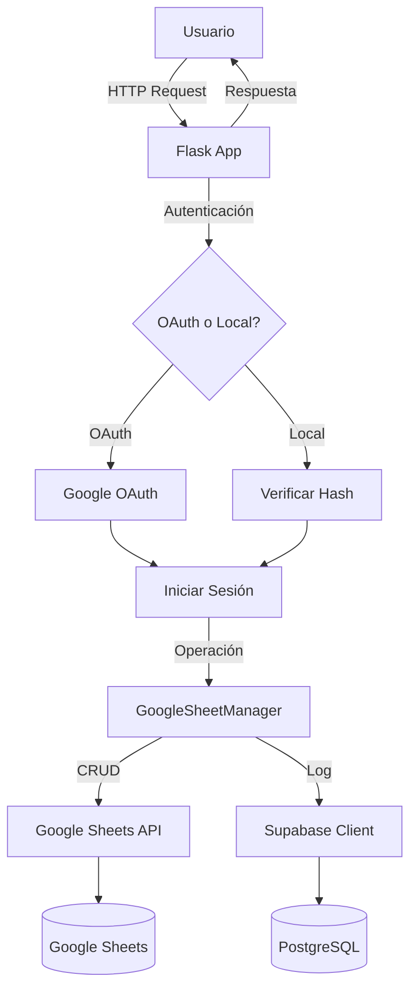

# Product Requirements Document (PRD)
## Sistema de Gestión de Certificados de Análisis - Coadix

**Versión:** 2.0  
**Fecha:** Febrero 2026  
**Autor:** Equipo de Desarrollo Coadix  
**Estado:** Activo

---

## 1. Resumen Ejecutivo

### 1.1 Visión del Producto
Coadix es un sistema web integral para la gestión, registro y emisión de certificados de análisis de productos farmacéuticos y veterinarios. La plataforma digitaliza el proceso completo desde el registro de análisis hasta la generación de certificados PDF profesionales, eliminando procesos manuales y reduciendo errores.

### 1.2 Objetivos del Negocio
- **Digitalización:** Eliminar el uso de hojas de cálculo locales y documentos físicos
- **Trazabilidad:** Mantener un historial completo de todas las operaciones y usuarios
- **Accesibilidad:** Permitir acceso remoto seguro desde cualquier ubicación
- **Eficiencia:** Reducir el tiempo de generación de certificados de horas a minutos
- **Cumplimiento:** Garantizar la integridad y autenticidad de los certificados emitidos

### 1.3 Usuarios Objetivo
- **Analistas de Laboratorio:** Registro y edición de resultados de análisis
- **Supervisores de Calidad:** Revisión y aprobación de certificados
- **Administradores de Sistema:** Gestión de usuarios, productos y configuración

---

## 2. Funcionalidades Principales

### 2.1 Gestión de Certificados

#### 2.1.1 Registro de Certificados
**Descripción:** Permite crear nuevos certificados de análisis con información completa del producto y resultados.

**Campos Obligatorios:**
- Código de certificado (generado automáticamente)
- Producto (selección desde catálogo)
- Presentación
- Lote
- Fechas: Producción, Vencimiento, Análisis, Emisión
- Ensayos y especificaciones (hasta 20 parámetros)
- Resultados de análisis
- Conclusión (APROBADO/RECHAZADO/PENDIENTE)

**Validaciones:**
- Fechas coherentes (producción < vencimiento)
- Formato de lote
- Campos numéricos en resultados
- Selección de especificaciones según versión del producto

#### 2.1.2 Edición de Certificados
**Descripción:** Modificación de certificados existentes con control de permisos.

**Restricciones:**
- Solo usuarios con rol Supervisor o Administrador pueden editar
- Campos de auditoría (código, fecha de registro, creador) son inmutables
- Se registra cada modificación en el log de actividad

#### 2.1.3 Búsqueda y Filtrado
**Descripción:** Sistema de búsqueda avanzada con filtros múltiples.

**Capacidades:**
- Búsqueda por texto libre (código, producto, lote, conclusión)
- Filtros por rango de fechas
- Búsqueda multi-término (ej: "APROBADO AMOXICILINA")
- Paginación (20 registros por página)
- Búsqueda en tiempo real con AJAX

#### 2.1.4 Generación de PDF
**Descripción:** Exportación de certificados a PDF con dos formatos disponibles.

**Formatos:**
1. **Certificado Estándar:** Diseño genérico con logo Pharmadix
2. **Certificado Agrovet:** Diseño personalizado con branding Agrovet Market

**Características:**
- Generación en memoria (sin archivos temporales)
- Visualización en navegador
- Descarga directa
- Registro de cada generación en log de actividad

### 2.2 Dashboard y Analítica

#### 2.2.1 Métricas Principales
- **Total de certificados** registrados
- **Tasa de aprobación** (porcentaje)
- **Distribución por conclusión** (gráfico de torta)
- **Tendencia mensual** (gráfico de líneas)

#### 2.2.2 Filtros de Dashboard
- Filtro por producto
- Filtro por rango de fechas
- Resumen mensual del año actual
- Navegación rápida por mes (clic en tabla)

### 2.3 Gestión de Productos

#### 2.3.1 Catálogo de Productos
**Descripción:** Administración centralizada del catálogo de productos analizables.

**Estructura:**
- Nombre del producto
- Forma farmacéutica (tableta, jarabe, polvo, etc.)
- Presentaciones disponibles (múltiples por producto)

#### 2.3.2 Especificaciones Técnicas
**Descripción:** Maestro de especificaciones versionado por producto.

**Campos:**
- Producto
- Versión de especificación
- Descripción del ensayo
- Especificación (rango o valor esperado)

**Funcionalidad:**
- Carga dinámica según producto y versión seleccionados
- Autocompletado en formularios de certificados

### 2.4 Gestión de Usuarios

#### 2.4.1 Roles y Permisos

| Rol | Permisos |
|-----|----------|
| **Operario** | Ver certificados, crear certificados, generar PDF |
| **Supervisor** | Todo lo anterior + editar certificados, gestionar productos |
| **Administrador** | Todo lo anterior + gestionar usuarios, ver logs de actividad |

#### 2.4.2 Operaciones de Usuarios
- Crear usuario (con validación de email corporativo)
- Editar usuario (cambiar rol, restablecer contraseña)
- Eliminar usuario (con restricción: no puede eliminar su propia cuenta activa)
- Búsqueda y filtrado de usuarios

### 2.5 Autenticación y Seguridad

#### 2.5.1 Métodos de Autenticación

**Autenticación Tradicional:**
- Usuario: Email corporativo
- Contraseña: Hasheada con PBKDF2-SHA256
- Limitación de intentos: 3 intentos por minuto
- Sesión: 15 minutos de inactividad

**Autenticación con Google OAuth 2.0:**
- Inicio de sesión con cuenta corporativa de Google
- Dominios permitidos: `@agrovetmarket.com`, `@pharmadix.com`
- Auto-registro: Usuarios con dominio válido se crean automáticamente con rol "Operario"
- Sin contraseña: Los usuarios OAuth no requieren contraseña en la base de datos

#### 2.5.2 Medidas de Seguridad
- **Hashing de contraseñas:** Werkzeug PBKDF2-SHA256
- **Rate limiting:** Flask-Limiter (200 req/día, 50 req/hora)
- **Sesiones seguras:** Flask sessions con SECRET_KEY
- **HTTPS:** Forzado en producción mediante ProxyFix
- **Validación de entrada:** Frontend (HTML5) y Backend (Python)
- **Control de acceso basado en roles:** Decoradores `@admin_required`, `@supervisor_required`

### 2.6 Log de Actividad

#### 2.6.1 Eventos Registrados
- Inicio/cierre de sesión
- Creación/edición/eliminación de certificados
- Creación/edición/eliminación de usuarios
- Creación/eliminación de productos
- Generación de PDF

#### 2.6.2 Información Capturada
- Usuario que realizó la acción
- Tipo de acción
- Detalles adicionales (ej: código de certificado afectado)
- Timestamp automático

---

## 3. Arquitectura Técnica

### 3.1 Stack Tecnológico

**Backend:**
- **Framework:** Flask 3.1.1 (Python)
- **Servidor WSGI:** Gunicorn 25.0.3 (producción)
- **Autenticación:** Authlib (OAuth 2.0)
- **Seguridad:** Werkzeug, Flask-Limiter

**Frontend:**
- **Motor de plantillas:** Jinja2
- **Framework CSS:** Bootstrap 5
- **JavaScript:** Vanilla JS (búsqueda AJAX, validaciones)
- **Gráficos:** Chart.js

**Bases de Datos:**
- **Principal:** Google Sheets (vía gspread)
- **Logs:** Supabase (PostgreSQL)

**Generación de Documentos:**
- **PDF:** FPDF2 (pyfpdf)

### 3.2 Arquitectura de Datos

#### 3.2.1 Google Sheets - Estructura

**Hoja "Hoja 1" (Certificados):**
- 17 columnas fijas + 60 columnas dinámicas (20 ensayos × 3 campos)
- Orden: CODIGO, PRODUCTO, PRESENTACION, LOTE, VERSION_ESPECIFICACION, FORMA_FARMACEUTICA, CANTIDAD, fechas, LABORATORIO, REFERENCIA, FECHA_DE_REGISTRO, CONCLUSION, OBSERVACIONES, CREADO_POR, ENSAYO1...RESULTADO20

**Hoja "Productos":**
- PRODUCTO, FORMA_FARMACEUTICA, PRESENTACION

**Hoja "Maestro Especificaciones":**
- PRODUCTO, VER, DESCRIPCIÓN, ESPECIFICACIÓN

**Hoja "Usuarios":**
- USERNAME (email), PASSWORD (hash), ROL

**Hoja "Configuración":**
- Parámetros generales del sistema

#### 3.2.2 Supabase - Tabla log_actividad
```sql
CREATE TABLE log_actividad (
  id SERIAL PRIMARY KEY,
  usuario TEXT NOT NULL,
  accion TEXT NOT NULL,
  detalles TEXT,
  timestamp TIMESTAMP DEFAULT NOW()
);
```

### 3.3 Flujo de Datos



### 3.4 Despliegue

**Entorno de Desarrollo:**
- Sistema Operativo: Windows/Linux/macOS
- Python: 3.9+
- Servidor: Flask development server
- Puerto: 5000

**Entorno de Producción (Render):**
- Plataforma: Render.com (Web Service)
- Comando de construcción: `pip install -r requirements.txt`
- Comando de inicio: `gunicorn app:app`
- Puerto: 10000 (detectado automáticamente)
- Variables de entorno requeridas:
  - `SECRET_KEY`
  - `GOOGLE_CREDS_JSON` (credenciales de cuenta de servicio)
  - `SUPABASE_URL`
  - `SUPABASE_KEY`
  - `GOOGLE_CLIENT_ID` (OAuth)
  - `GOOGLE_CLIENT_SECRET` (OAuth)

---

## 4. Requisitos No Funcionales

### 4.1 Rendimiento
- Tiempo de carga de página: < 2 segundos
- Tiempo de generación de PDF: < 3 segundos
- Búsqueda en tiempo real: < 500ms

### 4.2 Disponibilidad
- Uptime objetivo: 99.5%
- Ventana de mantenimiento: Domingos 2:00 AM - 4:00 AM

### 4.3 Escalabilidad
- Soporte para hasta 10,000 certificados
- Hasta 50 usuarios concurrentes
- Crecimiento anual estimado: 2,000 certificados/año

### 4.4 Compatibilidad
- Navegadores: Chrome 90+, Firefox 88+, Edge 90+, Safari 14+
- Dispositivos: Desktop, Tablet (responsive design)
- Resoluciones: 1280x720 mínimo

### 4.5 Seguridad
- Cumplimiento con OWASP Top 10
- Encriptación en tránsito (HTTPS)
- Backup diario automático (Google Sheets nativo)
- Retención de logs: 1 año

---

## 5. Roadmap y Mejoras Futuras

### 5.1 Corto Plazo (Q1-Q2 2026)
- [ ] Notificaciones por email al generar certificados
- [ ] Exportación masiva a Excel
- [ ] Firma digital de certificados PDF
- [ ] Dashboard personalizable por usuario

### 5.2 Mediano Plazo (Q3-Q4 2026)
- [ ] API REST para integraciones externas
- [ ] Aplicación móvil (iOS/Android)
- [ ] Workflow de aprobación multi-nivel
- [ ] Integración con LIMS (Laboratory Information Management System)

### 5.3 Largo Plazo (2027+)
- [ ] Machine Learning para detección de anomalías en resultados
- [ ] Blockchain para trazabilidad inmutable
- [ ] Migración a base de datos relacional (PostgreSQL completo)

---

## 6. Métricas de Éxito

### 6.1 KPIs Operacionales
- **Tiempo promedio de registro:** < 5 minutos por certificado
- **Tasa de error en datos:** < 1%
- **Certificados generados por día:** > 20

### 6.2 KPIs de Adopción
- **Usuarios activos mensuales:** > 80% del total
- **Satisfacción del usuario:** > 4/5 en encuestas
- **Tiempo de capacitación:** < 2 horas por usuario nuevo

### 6.3 KPIs Técnicos
- **Tiempo de respuesta promedio:** < 1 segundo
- **Tasa de errores:** < 0.1%
- **Disponibilidad mensual:** > 99.5%

---

## 7. Dependencias y Riesgos

### 7.1 Dependencias Críticas
- **Google Sheets API:** Disponibilidad y cuotas de uso
- **Supabase:** Disponibilidad del servicio
- **Render:** Uptime de la plataforma de hosting
- **OAuth de Google:** Funcionamiento del servicio de autenticación

### 7.2 Riesgos Identificados

| Riesgo | Probabilidad | Impacto | Mitigación |
|--------|--------------|---------|------------|
| Caída de Google Sheets API | Media | Alto | Implementar caché local, considerar migración a DB |
| Expiración de credenciales OAuth | Baja | Medio | Monitoreo automático, alertas |
| Sobrecarga de Render (plan gratuito) | Alta | Medio | Plan de upgrade a plan pagado |
| Pérdida de datos en Sheets | Muy Baja | Crítico | Backups automáticos de Google, export semanal |

---

## 8. Apéndices

### 8.1 Glosario
- **COA:** Certificate of Analysis (Certificado de Análisis)
- **LIMS:** Laboratory Information Management System
- **OAuth:** Open Authorization (protocolo de autenticación)
- **WSGI:** Web Server Gateway Interface

### 8.2 Referencias
- [Documentación de Flask](https://flask.palletsprojects.com/)
- [Google Sheets API](https://developers.google.com/sheets/api)
- [Supabase Docs](https://supabase.com/docs)
- [Render Deployment Guide](https://render.com/docs)

### 8.3 Historial de Versiones

| Versión | Fecha | Cambios Principales |
|---------|-------|---------------------|
| 1.0 | Dic 2025 | Versión inicial del sistema |
| 1.5 | Ene 2026 | Añadido OAuth con Google, mejoras en dashboard |
| 2.0 | Feb 2026 | Robustez en manejo de errores, despliegue en Render, actualización masiva de contraseñas |
